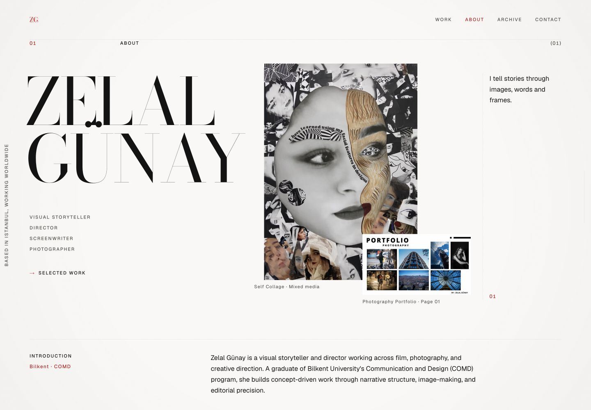
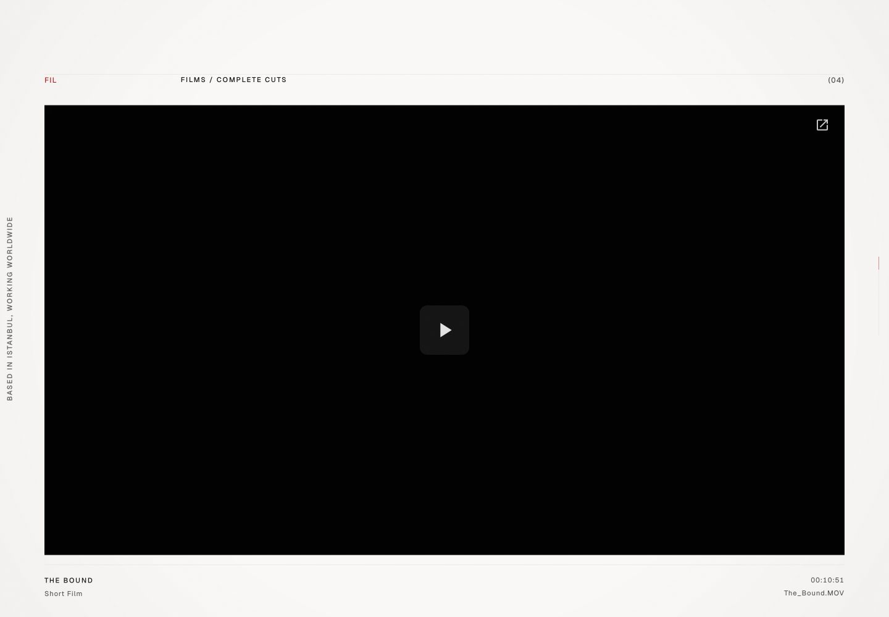
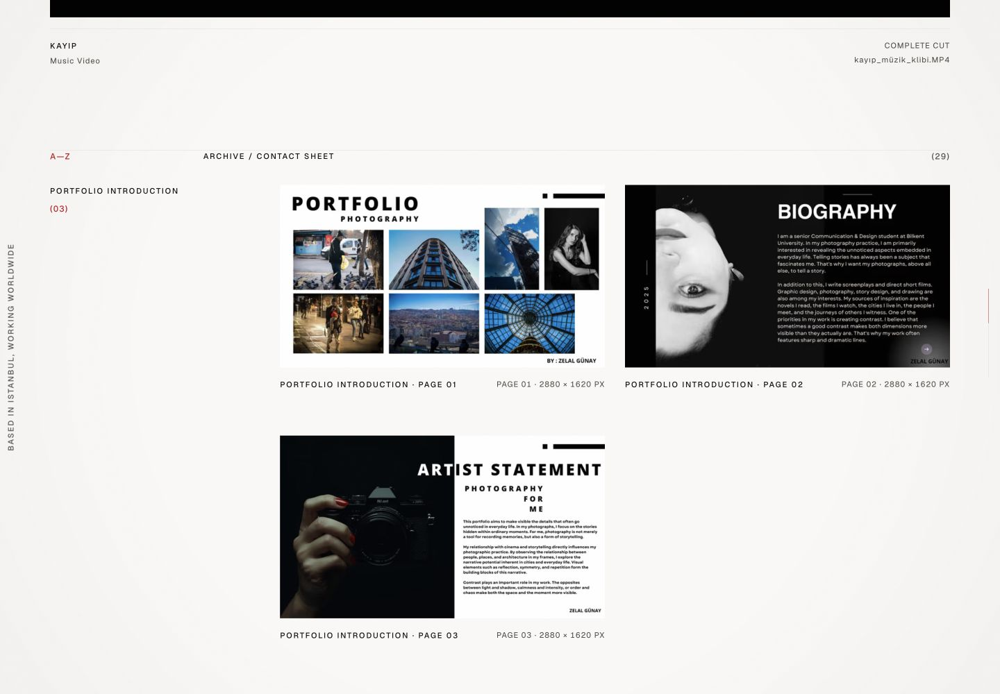
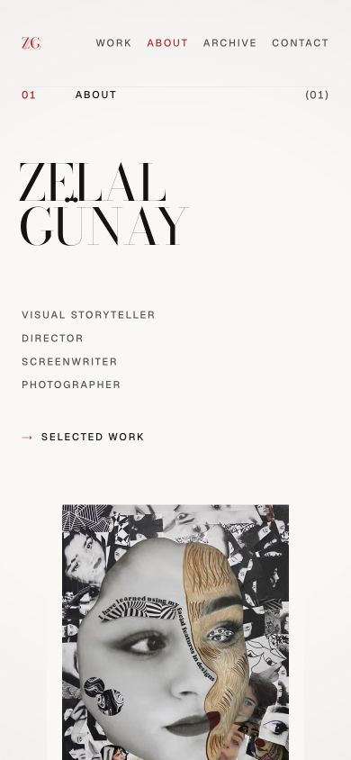

<div align="center">

# Zelal Günay — Visual Storytelling Portfolio

**Film · Photography · Creative Direction · Scriptwriting**

An editorial portfolio built to present complete works without cropping, trimming, or reframing the original media.

[Live Portfolio](https://zelal-portfolio.vercel.app) · [Instagram](https://www.instagram.com/zelalgunayy) · [Email](mailto:zelalaska@gmail.com)

</div>



## About the portfolio

Zelal Günay is a visual storyteller and director working across film, photography, and creative direction. A graduate of Bilkent University's Communication and Design (COMD) program, she develops concept-driven work through narrative structure, image-making, and editorial precision.

The site is designed as a long-form visual sequence rather than a generic portfolio template. Its 12-column editorial grid, high-contrast typography, restrained red accent, fixed edge architecture, and image-led pacing create a presentation language influenced by film titles, contact sheets, and printed matter.

## Selected work

The public portfolio contains only supplied work—no generated project cards or placeholder media.

| Collection                   | Public presentation                                             |
| ---------------------------- | --------------------------------------------------------------- |
| Short films and music videos | 4 original Google Drive files embedded as complete cuts         |
| Photography portfolio        | 23 complete pages presented in their original designed sequence |
| Collage board                | 1 indivisible A3 composition shown as a complete page           |
| Individual collage works     | 5 full-frame works with access to full-resolution assets        |



Every film uses a large 16:9 desktop player with fullscreen controls. On mobile, the player expands vertically so Google Drive's complete playback bar remains visible without widening or cropping the frame. The source files are embedded directly: the site does not trim, crop, transcode, mute, accelerate, autoplay, or force-loop the videos.

## Responsive editorial system

<table>
  <tr>
    <td width="68%" valign="top">
      
    </td>
    <td width="32%" valign="top">
      
    </td>
  </tr>
  <tr>
    <td align="center"><sub>Desktop archive / contact sheet</sub></td>
    <td align="center"><sub>Mobile hero</sub></td>
  </tr>
</table>

- Twelve-column desktop grid with asymmetric modules and generous negative space.
- Single-column mobile composition with no media overlap or horizontal overflow.
- Full-frame image treatment using natural aspect ratios and `object-fit: contain`.
- Didone display typography paired with a neutral grotesk for labels and body copy.
- Ambient color transitions derived at build time from the displayed images.
- Smooth scrolling, masked typography, parallax, image reveals, and a fine-pointer cursor layer.
- Motion-sensitive behavior is disabled when `prefers-reduced-motion` is enabled.

## Media integrity

Preserving the complete work is a project constraint, not a presentation preference.

- Source media is never overwritten.
- Images are not cropped, rotated, recolored, retouched, or reframed.
- The photography PDF is represented by 23 complete lossless page renders.
- The collage PDF remains one complete A3 board rather than separated elements.
- HEIC works receive full-frame lossless PNG delivery derivatives only for browser compatibility.
- Videos retain their full duration, frame, speed, playback order, and audio.

Checksums and the complete preservation record are documented in [`docs/media-integrity.md`](docs/media-integrity.md).

## Interaction and accessibility

- Semantic page landmarks and section headings.
- Keyboard-accessible navigation and visible focus treatments.
- Skip-to-content support.
- Meaningful alternative text for portfolio imagery.
- Reduced-motion fallback with directly visible content.
- Touch-safe behavior: hover interactions never block the first tap.
- Fixed image dimensions or aspect ratios to prevent layout shift.
- AVIF-first delivery through Next.js image optimization.

## Verified live-site QA

Last manually verified against the production deployment on **30 September 2026**.

| Check                     |                  Desktop · 1440 × 1000 |                  Mobile · 375 × 812 |
| ------------------------- | -------------------------------------: | ----------------------------------: |
| Horizontal overflow       |                                   None |                                None |
| Portfolio images          |                           31/31 loaded | Hero media loaded at complete ratio |
| Embedded videos           |       4/4 loaded and play/pause tested |  Playback bar and controls verified |
| Film player size          |                             1296 × 729 |       327 × 300 control-safe player |
| Main navigation           | Work, About, Archive, Contact verified |    All four anchor targets verified |
| Instagram and email links |                               Verified |                            Verified |
| Browser console errors    |                                   None |                                None |

## Technology

- [Next.js 16](https://nextjs.org/) with the App Router
- React 19 and strict TypeScript
- Tailwind CSS with a project-specific token system
- Motion for targeted reveal and parallax behavior
- Lenis for smooth scrolling
- Sharp for build-time dominant colors and blur placeholders
- Vercel production hosting

## Project structure

```text
app/                 Next.js routes, metadata, global styles
components/
  cursor/            Fine-pointer cursor and discipline preview
  layout/            Header, footer, section and page architecture
  motion/            Reveal, parallax, ambient and progress layers
  sections/          Hero, disciplines, films, photography and collage
  ui/                Shared links and typographic interaction elements
content/             Typed site, discipline and portfolio data
docs/                Media preservation record and README captures
hooks/               Interaction state and browser capability hooks
lib/                 Tokens, constants and shared utilities
public/              Self-hosted fonts and full-frame visual assets
scripts/             Build-time color and placeholder extraction
types/               Shared TypeScript domain types
```

## Local development

Requirements: Node.js 22 or newer.

```bash
npm ci
npm run dev
```

Open [http://localhost:3000](http://localhost:3000).

Before committing changes:

```bash
npm run check
npm run build
```

`npm run build` automatically regenerates the image manifest, dominant ambient colors, and blur placeholders before the production build.

## Deployment

The production site is deployed on Vercel from the `main` branch. Next.js image optimization remains enabled; the project intentionally does not use static export.

**Live:** [zelal-portfolio.vercel.app](https://zelal-portfolio.vercel.app)

---

Portfolio work and imagery © Zelal Günay. All rights reserved.
